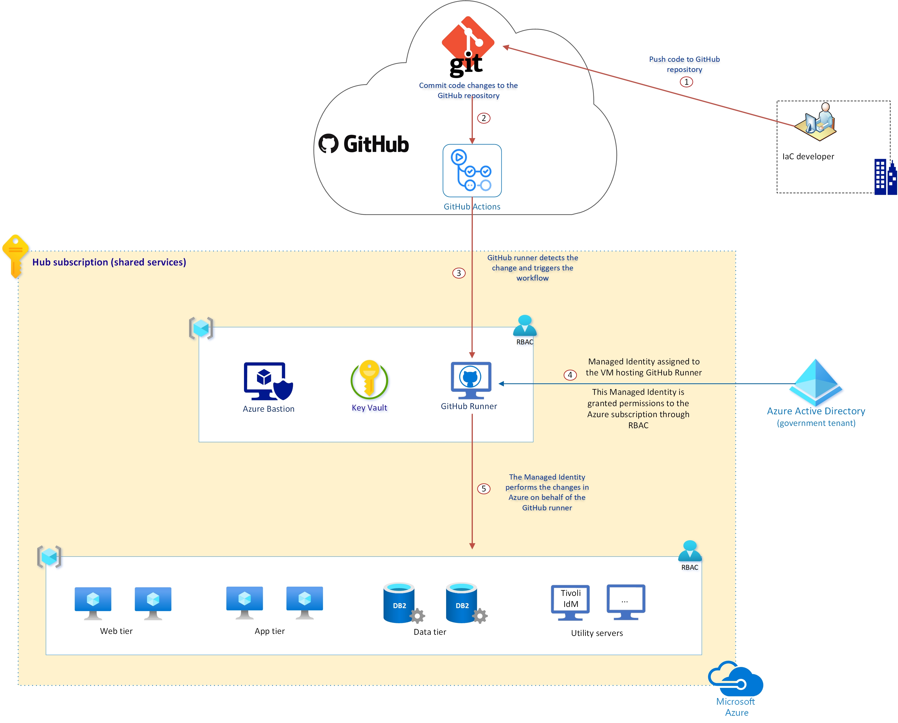

# Setting up self-hosted runner 

[Self-hosted runners](https://docs.github.com/en/actions/hosting-your-own-runners/about-self-hosted-runners) provide many benefits, among which the ability to prevent the storage of secrets within the GitHub Cloud. When using a self-hosted runner, you can configure your workflows to run under a managed identity instead of a Service Principal whose password has to be storted in the GitHub Cloud.

The diagram below depicts how a GitHub runner hosted in your Azure subscription would work:

   

The isntructions below provide the steps for installing the runner on Linux RedHat or Ubuntu. You can also install runners on Windows and  MacOS. 

## Create self-hosted runner on Redhat 
1. Create a VM running RedHat 7.7 or higher

2. Install Azure CLI by following the steps documented in this article: 
    https://docs.microsoft.com/en-us/cli/azure/install-azure-cli-yum?view=azure-cli-latest

3. Install PowerShell Core by following the steps documented in this article: 

    https://docs.microsoft.com/en-us/powershell/scripting/install/installing-powershell-core-on-linux?view=powershell-7#red-hat-enterprise-linux-rhel-7

4. Install Azure module for PowerShell  

   `sudo pwsh`  
   `Install-Module -Name Az -AllowClobber -Scope AllUsers`  
   `exit`  

5. Install Docker CE.

     `!/bin/bash # Install Docker CE on RHEL 7`  
     `# Update system.`  
     `sudo yum update -y`  

     `#Install required packages.`  
     `sudo yum install -y yum-utils device-mapper-persistent-data lvm2`  

     `#Install container-selinux.`  
     `sudo yum install -y http://mirror.centos.org/centos/7/extras/x86_64/Packages/container-selinux-2.107-3.el7.noarch.rpm`  

     `# Set up Docker repository.`  
     `sudo yum-config-manager --add-repo https://download.docker.com/linux/centos/docker-ce.repo`  

     `# Install Docker CE and tools.`  
     `sudo yum install -y docker-ce docker-ce-cli containerd.io`  

     `# Add current user to docker group.`  
     `sudo usermod -a -G docker $USER`  

     `# Start and enable docker service.`  
     `sudo systemctl start docker`   
     `sudo systemctl enable docker`  

     `# Run the following command to make sure the installation is working.`  
     `sudo docker run hello-world`

7. Install and configure the GitHub runner

   Go to your Repo in GitHub and click on "Settings". Then select "Actions" and click on "Ads runner". 
   Follow the instructions provided.

8. Install the runner as a service. For additional information click [here](https://docs.github.com/en/actions/hosting-your-own-runners/configuring-the-self-hosted-runner-application-as-a-service).

    `sudo ./svc.sh install`  
    `sudo ./svc.sh start` 

9. To setup Managed identity for this VM, refer to [Create a user-assigned managed identity](https://docs.microsoft.com/en-us/azure/active-directory/managed-identities-azure-resources/how-to-manage-ua-identity-portal#create-a-user-assigned-managed-identity) and assign it to the GitHub Runner VM.
Grant this Managed Identity the proper level of access to the subscriptions that you want it to manage. Finally, set an Access Policy in Key Vault to grant this Managed Identity permission to "get" secrets. 

## Create self-hosted runner on Ubuntu 
1. Create a VM running Ubuntu 18.04 or higher.
   
2. Login and prepare your machine with following commands

    `sudo apt-get update && sudo apt-get install`  

3. Install Azure CLI

    `curl -sL https://aka.ms/InstallAzureCLIDeb | sudo bash`  

4. Install PowerShell Core

    `wget -q https://packages.microsoft.com/config/ubuntu/18.04/packages-microsoft-prod.deb`  
    `sudo dpkg -i packages-microsoft-prod.deb`  
    `sudo apt-get update`  
    `sudo add-apt-repository universe`  
    `sudo apt-get install -y powershell`  

5. Install Azure module for PowerShell  

   `sudo pwsh`  
   `Install-Module -Name Az -AllowClobber -Scope AllUsers`  
   `exit`  

6. Install Docker.

   Follow the instructions here for Ubuntu: https://docs.docker.com/install/linux/docker-ce/ubuntu/

7. Grant permissions

    `sudo groupadd docker`  
    `sudo gpasswd -a $USER docker`  
    `sudo service docker restart`  
    `sudo chmod 666 /var/run/docker.sock`  

8. Follow the same steps as above for RedHat to install and configure the Runner.
